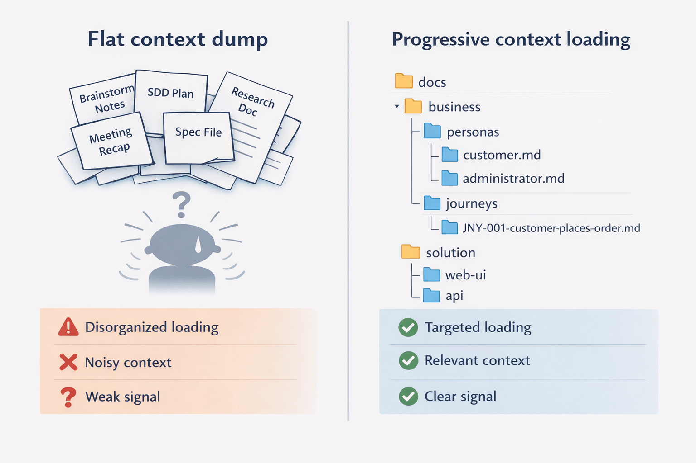
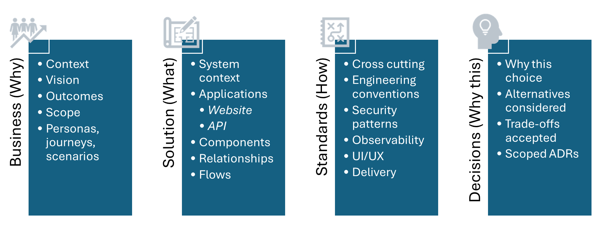

# Why–What–How

A context model for structuring engagement knowledge — designed for teams using agentic tools.

## The Problem

As teams bring agentic tools into their workflows, they generate more artifacts than ever — but repos become messy and fragmented. Agents choke on context because they treat every document as equal weight, adding noise instead of signal. A vision statement, a brainstorming scratch pad, an old spec plan, and half-finished research findings all look the same to them. Business intent gets buried, and designs drift tech-first because the "why" gets left behind.

## The Framework

Why–What–How is not a new process. It is a **structure** that existing processes feed into. It organises project knowledge into four areas:

| Area          | Framing    | Purpose                                                        |
| ------------- | ---------- | -------------------------------------------------------------- |
| **Business**  | Why        | Define intent and expected external behaviour                  |
| **Solution**  | What       | Define the structural decomposition that enables outcomes      |
| **Standards** | How        | Constrain implementation to maintain consistency and quality    |
| **Decisions** | Why This   | Preserve reasoning behind significant choices                  |

Every role on a cross-discipline team — engineers, programme managers, data scientists, designers — has a clear place to find what they need and contribute context from their work.

When writing something, ask:

- Is it about intent or expected behaviour? → **Business**
- Is it about structure or how parts interact? → **Solution**
- Is it about how we build consistently? → **Standards**
- Is it about why we made a choice? → **Decisions**

## The Practical Difference

Your stakeholder workshops and discovery outputs land in Business. Your architecture decisions land in Solution. Your conventions land in Standards. Agents can progressively load context by depth instead of consuming everything. New team members orient in minutes instead of hours. The business intent that drove the project stays front and centre — not scattered across working documents, spec files, and decision records with no clear home.

## The Four Areas

### Business (Why)

Business captures problem context, vision, outcomes, scope, personas, journeys, and scenarios. Everything in the business area is **black-box** — it describes what the system must do from the outside, who it serves, and why it matters. It never describes internal structure or implementation.

This matters because business intent stays first-class and independent of how the solution evolves. When the architecture changes, the business layer doesn't need to be rewritten. Agents working on business framing load this area without being distracted by solution details.

### Solution (What)

Solution captures the structural decomposition at progressive levels of depth:

- **System context** — the solution boundary and external systems it depends on
- **Applications** — the deployable units that make up the system and how they relate
- **Components** — stable responsibility boundaries inside an application
- **Flows** — white-box sequences showing how a specific interaction unfolds across applications or components

This layering is backed by a C4 model as the structural source of truth. Directory depth matches abstraction depth — an agent working on a specific application loads that application's folder, not the entire solution tree. An agent helping with system-level architecture loads the solution root.

### Standards (How)

Standards capture cross-cutting constraints that keep implementation consistent: engineering conventions, observability expectations, security patterns, UI/UX rules, and delivery practices. They apply across all applications and reduce entropy as the team and codebase grow.

### Decisions (Why This)

Decisions preserve reasoning using Architecture Decision Records (ADRs) — what was chosen, what alternatives existed, and what trade-offs were accepted.

Each ADR is **scoped to an area**: `solution` for system-wide choices, `application-<name>` for choices specific to one application, or `standards` for convention decisions. This scoping is deliberate — when an agent is working on a specific application, it loads only the decisions relevant to that application rather than every ADR in the repository. When working on system-level architecture, it loads solution-scoped decisions. The scope is visible in the filename: `ADR-0005-application-order-api-storage-technology.md`.

## What's in This Repo

The `docs/` folder contains **project-agnostic framework guidance files**. They define the model, conventions, folder structure, bootstrap playbook, and area-specific guidance. They are designed to be copied into your project repository as a starting point.

| File | Purpose |
| ---- | ------- |
| [docs.index.md](docs/docs.index.md) | Entry point and navigation router (template for your project) |
| [docs.why-what-how.md](docs/docs.why-what-how.md) | Core model: the four areas, what they capture, what they answer |
| [docs.why-what-how.area-guidance.md](docs/docs.why-what-how.area-guidance.md) | Expected sections and content patterns for each file type |
| [docs.why-what-how.bdd.md](docs/docs.why-what-how.bdd.md) | Behaviour stack: journeys, scenarios, BDD testing |
| [docs.why-what-how.c4model.md](docs/docs.why-what-how.c4model.md) | C4 model role, structural validation, export conventions |
| [docs.conventions.md](docs/docs.conventions.md) | Naming conventions, linking rules, ADR scope vocabulary |
| [docs.structure.md](docs/docs.structure.md) | Target folder tree and structural rules |
| [docs.bootstrap.md](docs/docs.bootstrap.md) | Phased creation playbook: what to create first, what to defer |

## How to Use

1. Copy the `docs/` folder into your project repository
2. Start with `docs.bootstrap.md` — it defines a phased creation order
3. Phase 1 is four files: `business-context.md`, `vision.md`, `outcomes.md`, `scope.md`
4. Build depth incrementally as your project needs it

The `docs.index.md` file is a template with placeholder sections for your project's Business, Solution, Standards, and Decisions content. Rename the project reference and populate the sections as you go.

## Key Design Principles

**Progressive context loading** — Agents load only the depth they need. Directory depth matches abstraction depth. An agent working on a specific application loads that application's folder, not the entire tree.

**Canonical knowledge = single source** — One structural graph (C4 DSL). One explanatory hierarchy (markdown). No duplicate relationship definitions.

**Business never points into Solution** — The implementer references the requirement, not the other way around. Business layer documents remain independent of solution internals.

**Definition and validation at every layer** — Each layer has both a definition side and a validation side. BDD catches intent errors. C4 validation catches structural errors. TDD catches implementation errors.

## Reference Example

See [why-what-how-bubbletea-kiosk-example](https://github.com/DavidBurela/why-what-how-bubbletea-kiosk-example) — a fully populated reference implementation demonstrating the framework on a bubble tea ordering kiosk project.

## License

This work is licensed under a [Creative Commons Attribution 4.0 International License](LICENSE).
